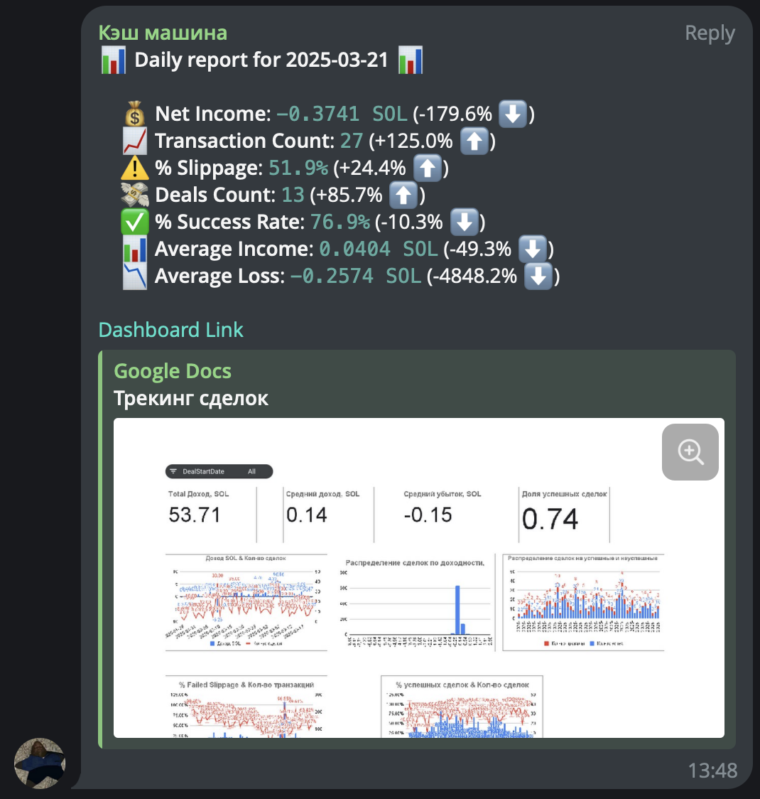

# Solana Bookkeeper Service

# Problem
* In the fast-paced Solana blockchain environment, tracking and analyzing wallet transactions manually is time-consuming and error-prone. Existing analytics platforms, such as gmgn.ai, often show discrepancies of 30% or more in actual earnings calculations due to limited on-chain data parsing and inaccurate trade grouping. Users lack visibility into real trading performance, slippage, and failed transactions — especially when operating across many tokens with varying transaction logic. There’s also no built-in way to get reliable, automated daily or weekly insights without building a custom system.

# Solution
* This service automatically monitors all transactions of a specific Solana wallet, accurately identifies completed token trades, and calculates associated fees, slippage, profits, and losses with high precision. It automatically generates a user-friendly dashboard in Google Sheets that presents all deal data in a clear and accessible format, making it easy to analyze performance at a glance. Additionally, it sends actionable daily and weekly summaries to Telegram. Unlike other tools, it reconstructs trade flows using detailed on-chain balance changes, resulting in realistic earnings data and better decision-making for active traders.

# Work Example
* [Dashboard Example](https://docs.google.com/spreadsheets/d/1M1tXijbf7j3pF6SDlOwXlhlDF1iEofuNJKAmXyAvkfU/edit?usp=sharing)
* Daily and Weekly summary:


# 🛠️ Solana Solana Bookkeeper Service — Setup Guide

This guide will walk you through setting up the **Solana Bookkeeper Service** that automatically:
- Tracks your wallet’s transactions
- Calculates profits, slippage, and fees
- Stores deals in a clean Google Sheets dashboard
- Sends daily and weekly reports to Telegram

---

## 1. Install Python

Make sure Python 3.8+ is installed:

```bash
python --version
```

If not installed, download from [python.org](https://www.python.org/downloads/)

---

## 2. Install Required Python Packages

Create a virtual environment (optional but recommended):

```bash
python -m venv venv
source venv/bin/activate  # On Windows: venv\Scripts\activate
```

Install dependencies:

```bash
pip install requests pandas schedule gspread oauth2client gspread_dataframe numpy
```

---

## 3. Prepare the Script

Save the Python code to a file in your project folder, e.g.:

```
solana_wallet_tracker.py
```

---

## 4. Create Google Service Account (For Google Sheets API)

1. Go to [Google Cloud Console](https://console.cloud.google.com/)
2. Create a **new project** (or use an existing one)
3. Navigate to **APIs & Services → Credentials**
4. Click **Create Credentials → Service account**
5. Give it a name (e.g., `sheets-access`) and click **Create and Continue**
6. Click **Done** to finish
7. In the list, click on your new service account → Go to **Keys tab**
8. Click **Add Key → Create new key → JSON**
9. Download and save the file to your project as:  
   ```
   g_cloud_token.json
   ```

---

## 5. Share Google Sheet with the Service Account

1. Open your **Google Spreadsheet**
2. Copy the `client_email` from `g_cloud_token.json`  
   Example:
   ```
   your-service-account@your-project.iam.gserviceaccount.com
   ```
3. Share the sheet with this email and give **Editor** access

---

## 6. Fill in Config in the Script

Edit the following variables in the script:

```python
WALLET_ADDRESS = "Your Solana wallet address (public key)"
TELEGRAM_CHAT_ID = "Your Telegram chat ID"
HELIUS_API_KEY = "Your Helius API key"
SERVICE_ACCOUNT_FILE = "g_cloud_token.json"
SPREADSHEET_NAME = "Name of your Google Spreadsheet"
SHEET_NAME = "Name of the sheet/tab inside the spreadsheet"
SPREADSHEET_LINK = "Full Google Spreadsheet URL"
```

---


## 7. Set Up Telegram Chat ID

1. Go to telegram web version: 
    ```
    https://web.telegram.org/
    ```
2. Create new chat and add our bot @solana_bookkeeper_bot (give him admin access):
3. Open this chat and copy number from URL withou hashtag (link example: https://web.telegram.org/a/#-1002448285775 -> -1002448285775 is your `TELEGRAM_CHAT_ID`)
4. Use that number as `TELEGRAM_CHAT_ID`

---

## 8. Get Your Helius API Key

1. Go to [Helius Dashboard](https://www.helius.xyz/)
2. Log in and create a **Mainnet** API key
3. Copy and paste it into `HELIUS_API_KEY`

---

## 9. Run the Script

Run the script:

```bash
python solana_wallet_tracker.py
```

You should see:

```
⏳ Scheduler started. Expecting 07:30 UTC every day...
```

The script will now:

- Collect transaction data daily at **07:30 UTC**
- Group and process trades
- Write to Google Sheets
- Send Telegram reports (daily + weekly on Mondays)

---

## ✅ Done!

Your service is now live locally.

### Optional:
- For 24/7 runtime, host it on a server (e.g. **AWS**, **Render**, **VPS**)
- Or use `screen` / `tmux` to keep it running in background

---